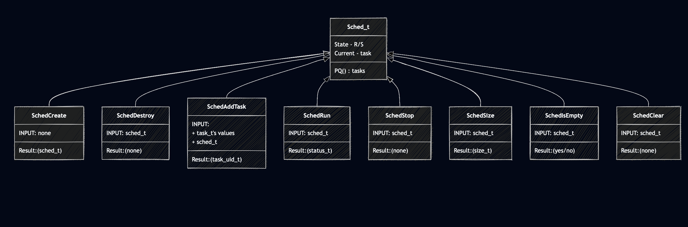
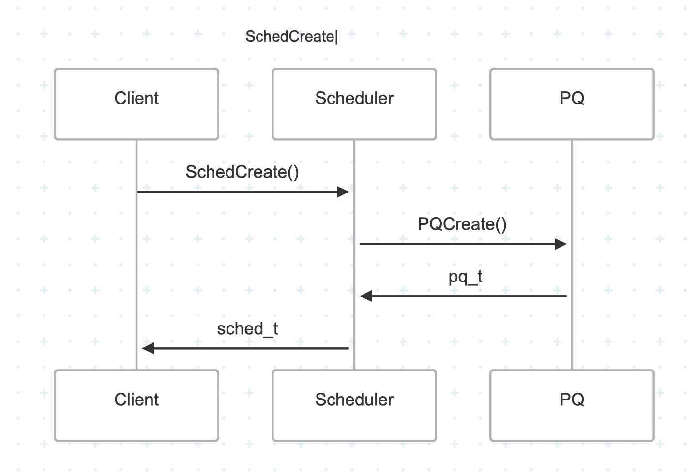
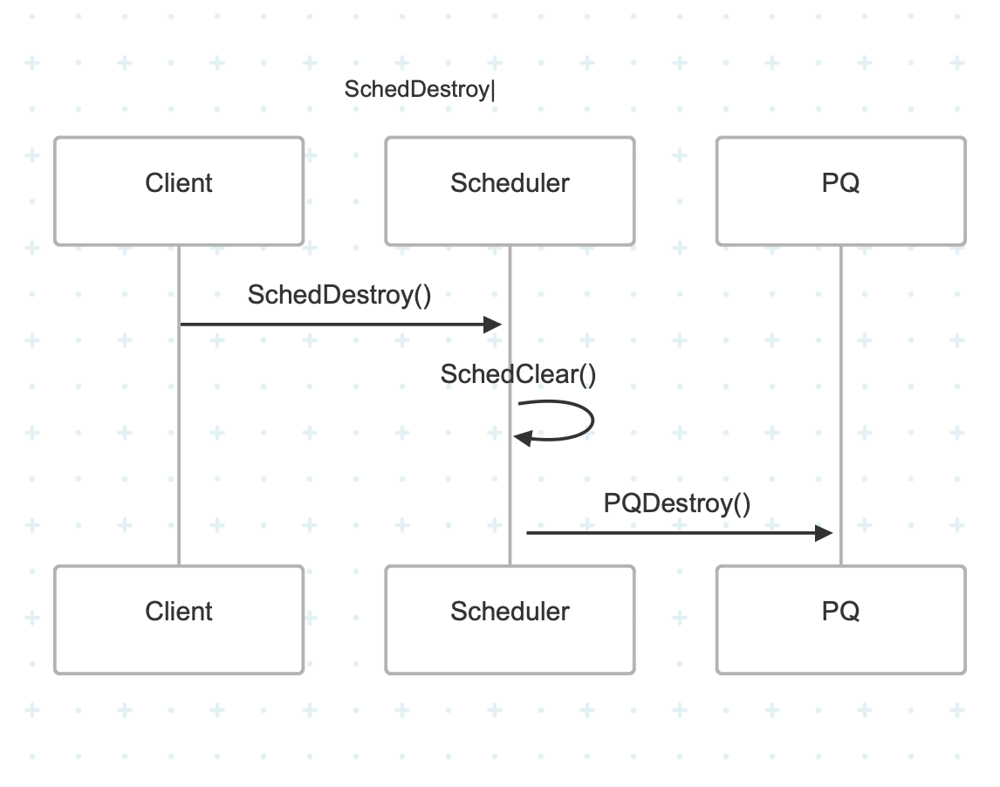
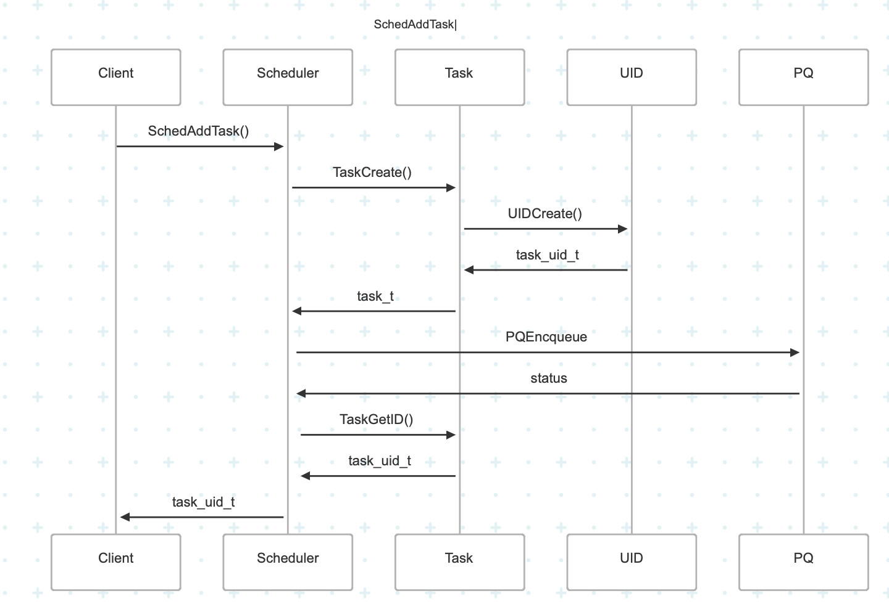
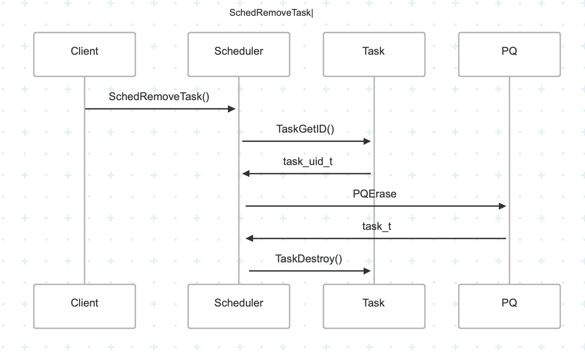
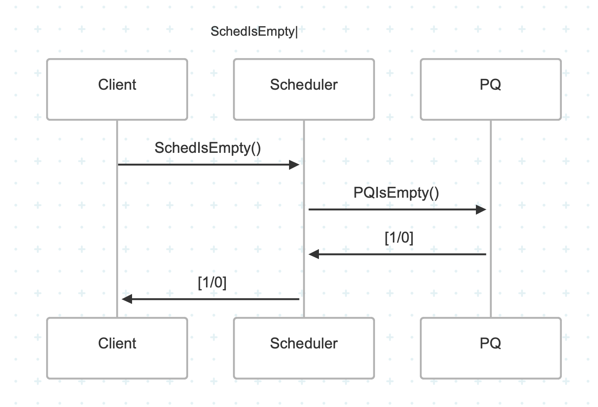
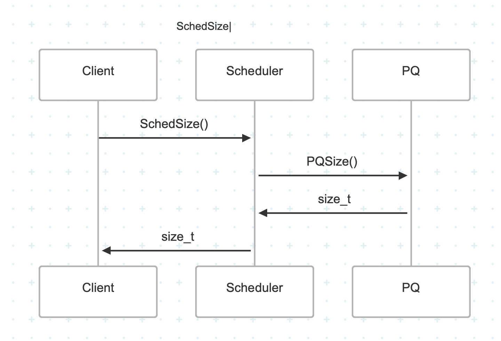
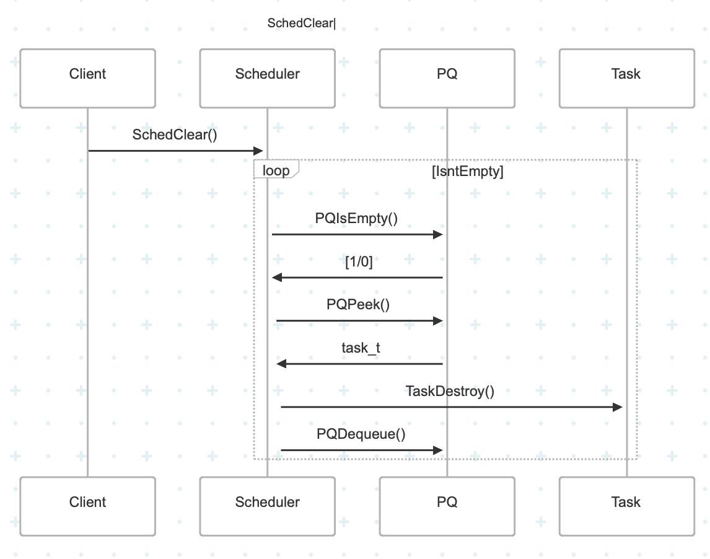
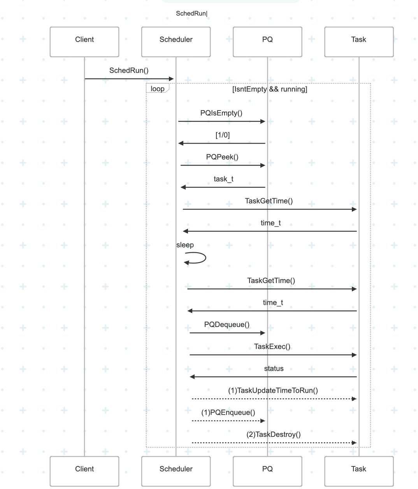
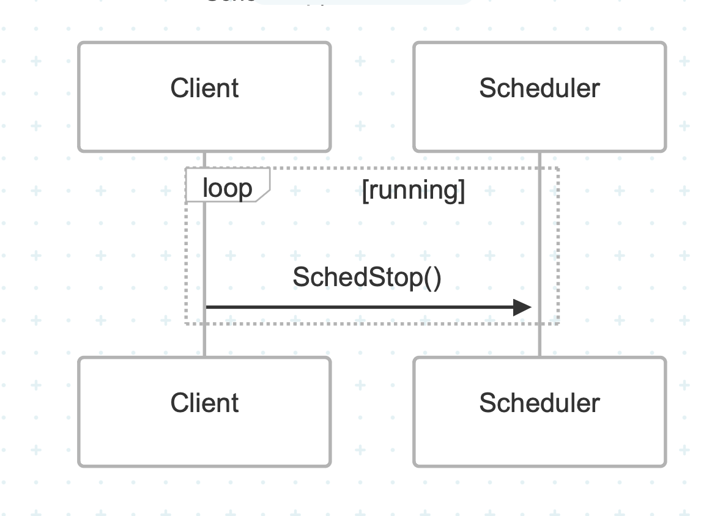

# Scheduler

 Running Tasks at a specified time.

 Set any task for any time, and it will execute!

## API
* [SchedCreate](###SchedCreate)
* [SchedDestroy](#SchedDestroy)
* [SchedAddTask](#SchedAddTask)
* [SchedRemoveTask](#SchedRemoveTask)
* [SchedIsEmpty](#SchedIsEmpty)
* [SchedSize](#SchedSize)
* [SchedClear](#SchedClear)
* [SchedRun](#SchedRun)
* [SchedStop](#SchedStop)

### SchedCreate

### SchedDestroy

### SchedAddTask

### SchedRemoveTask

### SchedIsEmpty

### SchedSize

### SchedClear

### SchedRun

### SchedStop

